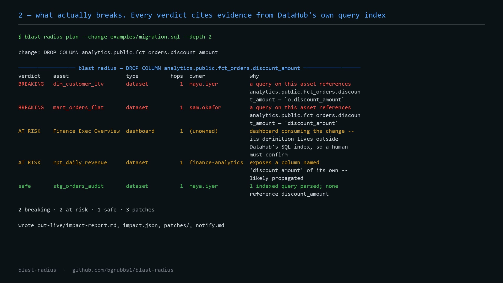

# Blast Radius

**Know what a schema change breaks — before you ship it.**

You are about to drop a column. Downstream are finance models, a `SELECT *`
report whose shape will drift, and an unowned executive dashboard. DataHub knows
they are connected. Blast Radius asks it, proves which ones actually break,
tells you who to notify, and writes the migration patches.

[Watch the 78-second public demo](https://youtu.be/RT65Dc0qxLA)

[](https://youtu.be/RT65Dc0qxLA)

```console
$ blast-radius plan --change "ALTER TABLE analytics.public.fct_orders DROP COLUMN discount_amount" --fail-on breaking

change: DROP COLUMN analytics.public.fct_orders.discount_amount
──────────────── blast radius — DROP COLUMN analytics.public.fct_orders.discount_amount ────────────────
verdict   asset                              type          hops owner             why
BREAKING  analytics.marts.dim_customer_ltv   dataset          1 maya.iyer         a query on this asset references … — `o.discount_amount`
BREAKING  analytics.marts.mart_orders_flat   dataset          1 sam.okafor        a query on this asset references … — `discount_amount`
AT RISK   analytics.marts.rpt_daily_revenue  dataset          1 finance-analytics exposes a column named 'discount_amount' of its own
AT RISK   Finance Exec Overview              dashboard        1 (unowned)         dashboard consuming the change — a human must confirm
safe      analytics.staging.stg_orders_audit dataset          1 maya.iyer         1 indexed query parsed; none reference discount_amount

2 breaking · 2 at risk · 1 safe · 3 patches
$ echo $?
2
```

Exit code 2 means CI just stopped you from breaking the finance dashboard.

## Try it in 30 seconds, without DataHub

The demo replays recorded MCP responses from `fixtures/`, so it needs no
infrastructure at all:

```bash
pip install -e .
blast-radius demo --out out/
```

That writes `out/impact-report.md` (the artefact you paste into a PR),
`out/impact.json` (machine-readable), `out/notify.md`, and `out/patches/*.diff`.
Pre-generated copies live in [`examples/`](examples/).

## What it does that a lineage graph does not

Opening the lineage tab tells you *what is downstream*. It does not tell you what
**breaks**, and that difference is the entire job:

| | |
|---|---|
| **Proves impact from real queries** | Reads the SQL DataHub has indexed for each downstream asset and parses it (sqlglot). A verdict of `BREAKING` means a query names the column — quoted in the report. |
| **Separates "breaks" from "drifts"** | `SELECT *` over the changed table does not fail, but the asset's output schema silently changes. That is `AT_RISK`, reported differently from a hard break. |
| **Never calls unknown "safe"** | No indexed queries, or SQL we could not parse, is `AT_RISK` with the reason stated. Silence is not evidence. |
| **Writes the migration** | Renames are rewritten across every reference (AST, not regex) and keep the old name as an output alias so *their* consumers survive. Drops remove dead projections. |
| **Refuses to guess** | A column used in a `WHERE`, `JOIN` or `GROUP BY` encodes intent. Those patches come back marked `review` with a `TODO` at the top, never silently "fixed". |
| **Tells you who to talk to** | Owners and domains, grouped, worst-first — including an explicit `(unowned)` bucket, because an unowned breaking asset is its own finding. |
| **Feeds the catalog back** | `--write-back` appends a warning to the changed column's description and saves a linked impact-analysis document, so the next person or agent inherits the result. |

## How DataHub is used

Everything comes from the [DataHub MCP Server](https://docs.datahub.com/docs/features/feature-guides/mcp)
(`uvx mcp-server-datahub@0.6.0`, overrideable with `BLAST_RADIUS_MCP_ARGS`),
against **DataHub Core or DataHub Cloud**:

| MCP tool | What Blast Radius does with it |
|---|---|
| `search` | resolve a table name from DDL to a dataset URN |
| `get_lineage` | walk downstream N hops (datasets, dashboards, charts, ML feature tables) |
| `get_entities` | ownership, domain and display names for everything found |
| `list_schema_fields` | detect a same-named column propagated downstream |
| `get_dataset_queries` | the real SQL that proves or clears each asset |
| `get_me` | connectivity check in `blast-radius doctor` (DataHub Cloud only) |
| `update_description`, `save_document` | optional `--write-back` (needs `TOOLS_IS_MUTATION_ENABLED=true`) |

Tool **argument names are discovered from each tool's input schema** at connect
time rather than hardcoded, so a server release that renames `max_hops` to `hops`
degrades to a warning instead of a crash. `mcp` 2.0 exposes that schema as
`input_schema`; reading only the wire's camelCase `inputSchema` returns nothing and
leaves the client guessing argument names, which is exactly the bug fixed in
`357962b`. Both spellings are now tried, newest first.

## Install

```bash
git clone https://github.com/bgrubbs1/blast-radius
cd blast-radius
python -m venv .venv && . .venv/bin/activate      # Windows: .venv\Scripts\activate
pip install -e ".[dev]"
```

Requires Python 3.10+ and [`uv`](https://docs.astral.sh/uv/) on PATH (for `uvx`).

### Point it at DataHub

```bash
# DataHub Core, local quickstart:
pip install acryl-datahub && datahub docker quickstart

export DATAHUB_GMS_URL=http://localhost:8080
export DATAHUB_GMS_TOKEN=<Settings → Access Tokens → Generate>

blast-radius doctor          # lists the tools the server actually exposes
```

`doctor` output tells you exactly what is wrong when something is: no DataHub, no
token, or no `uvx`.

For live catalogs, read [`PRIVACY.md`](PRIVACY.md) first. The detailed reports
can contain SQL, schemas, asset and owner identities, and internal URNs. Do not
connect this public contest checkout or its public CI to employer/customer data.

## Usage

```bash
# a DDL string, a file, or piped stdin
blast-radius plan --change "ALTER TABLE db.orders RENAME COLUMN amt TO amount_usd"
blast-radius plan --change migration.sql --dialect snowflake --depth 3 --out out/

# a dbt model diff -- removed SELECT columns are treated as drops
git diff models/marts/fct_orders.sql | blast-radius plan --out out/

# gate a PR in CI
blast-radius plan --change migration.sql --fail-on breaking

# annotate DataHub with the outcome
blast-radius plan --change migration.sql --write-back

# add a prose summary from any OpenAI-compatible endpoint (LM Studio, vLLM, …)
blast-radius plan --change migration.sql --llm --llm-base-url http://localhost:1234/v1

# a remote endpoint additionally requires informed egress acknowledgement
blast-radius plan --change migration.sql --llm --llm-provider anthropic --allow-remote-llm
```

Useful flags: `--urn` (skip search), `--depth` (lineage hops, default 2),
`--query-limit`, `--record` (save raw live responses to an explicit private
`--fixtures` directory), `--offline` (replay fixtures), and
`--fail-on breaking|at-risk|never`.

### In CI

The checked-in [`.github/workflows/schema-guard.yml`](.github/workflows/schema-guard.yml)
is safe for this public repository: it analyzes every changed SQL file using
only the bundled synthetic fixtures, receives no DataHub secrets, and uploads
only synthetic-catalog output. For a live catalog, run the guard in a private
repository with protected trusted-code execution and private detailed reports;
see [`PRIVACY.md`](PRIVACY.md).

## Where the LLM is — and is not

The impact engine is **deterministic**. Verdicts come from parsed SQL and lineage,
not from a model, so the same change always produces the same report and a
reviewer can check every claim. An LLM is used for exactly one thing, only with
`--llm`: the prose summary at the top. The report labels that paragraph as model
output, and the model is explicitly forbidden from re-ranking severity.

This also means the tool works with **no API key and no cloud** — and if you do
want the summary, a local LM Studio endpoint is the default.

A remote endpoint receives the change, dataset and asset names, owner names,
lineage hops, evidence details, counts, and patch metadata. Non-loopback use is
blocked unless `--allow-remote-llm` is present. Confirm the data owner and model
provider permit that transfer.

## Design notes

- **Evidence or nothing.** Every non-safe verdict carries an `Evidence` record
  with a quotable detail and, where there is one, the SQL snippet. If we cannot
  point at something, we say "unproven".
- **Expand/contract rollout.** The report's rollout order is the safe sequence for
  the specific operation (expand → migrate → verify → contract), not generic
  advice.
- **Fixtures are recorded from a real DataHub.** `fixtures/` contains the actual
  MCP responses from a DataHub Core 1.7.0 instance seeded by
  `scripts/seed_datahub.py`. `blast-radius demo` replays them and produces
  byte-identical findings to the live run, and `pytest` asserts on them: 68 tests,
  no network.
- **The adaptive layer is not theoretical.** Against the real server, `search`
  rejected the `filters` argument; the client parsed the rejected parameter out of
  the error, retried without it, and the run completed with a warning in the
  report. That is the mechanism working, recorded in `examples/impact-report.md`.

```bash
pytest -q                          # 68 passed
python scripts/check_examples.py   # fixtures still reproduce examples/

# re-record the synthetic seed into an ignored local directory
python scripts/seed_datahub.py --gms http://localhost:8080
blast-radius plan --change examples/migration.sql --depth 2 --record \
  --fixtures .private-fixtures/datahub-1.7.0
```

Recordings preserve complete decoded MCP payloads, including SQL and owner
metadata. Never record an employer/customer catalog into `fixtures/`, commit a
live capture, or publish one without independent sanitization and approval.

## Layout

```
blastradius/
  change.py     DDL + dbt-diff parsing            (regex, validated by sqlglot)
  datahub.py    MCP client: discovery, replay, record
  extract.py    tolerant payload readers + SQL column-reference analysis
  impact.py     deterministic verdicts from lineage, schemas and queries
  patch.py      AST rewrites; mechanical vs review
  report.py     markdown / JSON / terminal rendering
  llm.py        optional prose summary (any OpenAI-compatible endpoint)
  writeback.py  optional DataHub annotations
  cli.py        plan / demo / doctor
scripts/        seed a local DataHub with the demo warehouse; example-drift guard
fixtures/       MCP responses recorded from a real DataHub Core instance
examples/       generated report, patches and notify list
PRIVACY.md      public/private data boundary and safe live-use rules
```

## Limitations

- Column-level proof is only as good as DataHub's query index. Assets with no
  indexed queries are reported `AT_RISK`, never `SAFE`.
- Dashboards, charts and ML feature tables are judged by lineage alone; their
  definitions are not SQL that DataHub exposes.
- `parse_change` covers `DROP COLUMN`, `RENAME COLUMN`, a type change and
  `DROP TABLE`. Adding a column is not a breaking change and is out of scope.
- Patches are generated per indexed query, not per repository file — they are the
  starting point of a PR, not the whole PR.

## License

Apache 2.0 — see [LICENSE](LICENSE). Built for
[Build with DataHub: The Agent Hackathon](https://datahub.devpost.com/).
Pre-existing code disclosure: [DISCLOSURES.md](DISCLOSURES.md).
